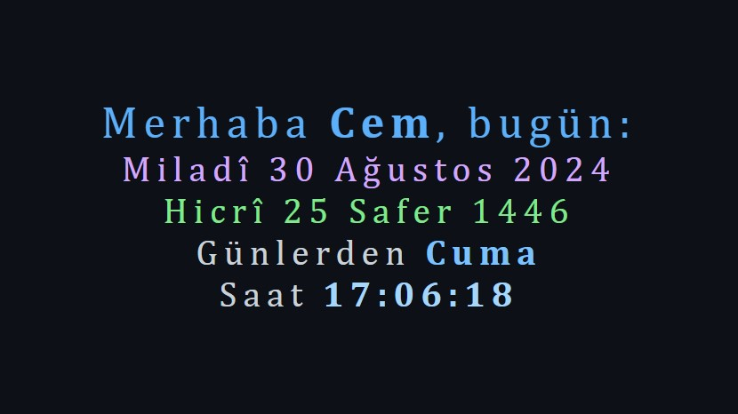

# greeting-with-calendar
Patika Beginner Frontend Web Development Path Certification Task
 Greeting with Calendar

Warning: The Hijri date shows a 1-day deviation. The task didn't include a hijri date and I will not use those codes in any other project, so I didn't dwell on it.

Browse: <https://cemcelikgh.github.io/greeting-with-calendar/>

